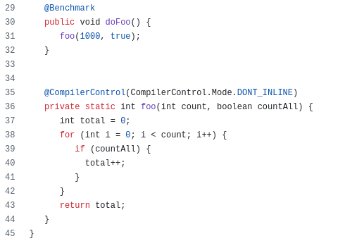
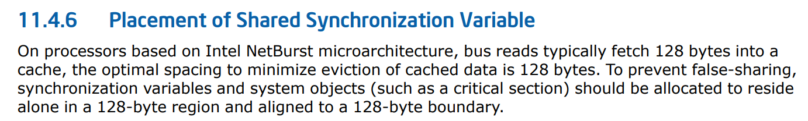
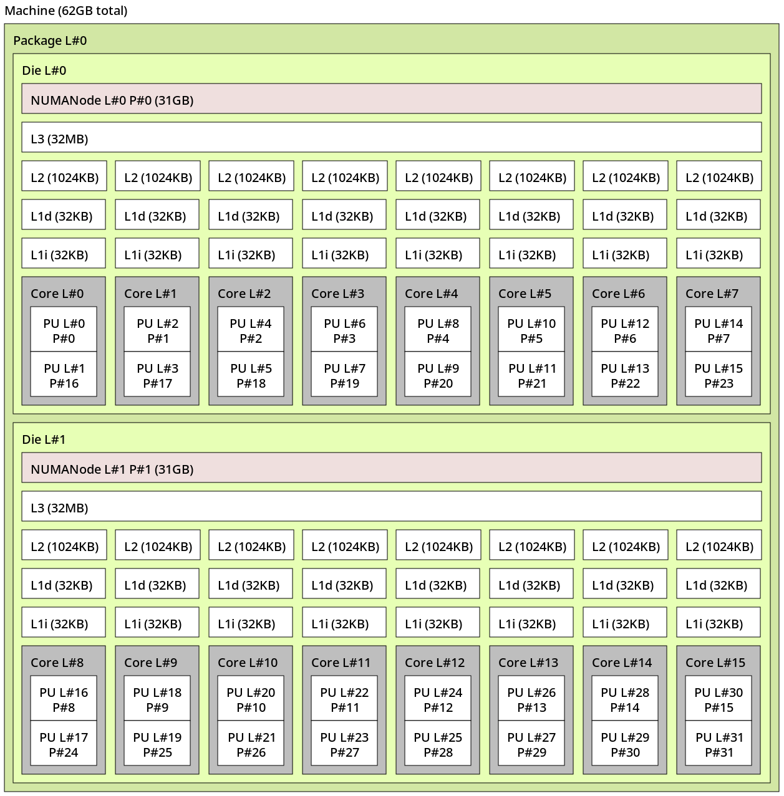

# JVM Challenges in Containers

The landscape of software deployment has been transformed by containers, which have become the de facto standard for modern applications. Containers offer lightweight, portable, and consistent environments, and with the rise of orchestration platforms like Kubernetes, developers and operators can efficiently deploy, scale, and manage applications across diverse infrastructures.

However, this new containerized world is not without challenges -particularly for applications with nuanced runtime requirements, such as those built on the Java Virtual Machine (JVM). The JVM, a cornerstone of enterprise software, was originally designed in an era when it could assume unrestricted access to the underlying system's resources. Containers, in contrast, abstract these resources and often impose quotas on CPU, memory, and other critical parameters.

While the JVM has evolved to become more container-aware — incorporating features like container-cgroup resource detection — there remains a gap in ensuring that all of its components can function optimally within the constraints of a containerized environment.

This is especially true for the Just-In-Time (JIT) compilers, C1 and C2, which are essential for delivering peak application performance. These components are particularly sensitive to suboptimal resource allocation or misconfiguration, and their efficiency can be severely hampered in containers that are not tuned for JVM workloads.

Unfortunately, while containers excel at abstracting infrastructure and simplifying deployment, they do not natively address the specific needs of the JVM — in short, they are not JVM-aware.
This leaves developers and operators responsible for bridging the gap. Despite the promise of containers to abstract away low-level runtime details, achieving a healthy and efficient JVM runtime still requires an understanding of the underlying system and careful configuration.

In this series of articles we’ll present what happens to a Java application running with shortage of resources and the impact to its performance.
Furthermore, since our Application Service Performance Team is known https://redhatperf.github.io/post/type-check-scalability-issue/[to find stealthy scalability issues], in this part we’ll reveal another scary one.

# Tiered Compilation Basics

First, let’s recall a key mechanism employed by OpenJDK Hotspot to optimize the application’s code: Tiered Compilation.

Tiered compilation in the HotSpot JVM balances application startup speed and runtime performance by using https://developers.redhat.com/articles/2021/06/23/how-jit-compiler-boosts-java-performance-openjdk[multiple levels] of code execution and optimization.
Initially, it uses an interpreter for immediate execution. As methods are invoked frequently, it employs a fast compiler i.e. C1 to generate native code.
Over time, methods that are heavily used ("hot spots") are further optimized with the optimizing compiler i.e. C2, which applies advanced optimizations for maximum performance.

This tiered approach ensures quick application responsiveness while progressively optimizing performance-critical code paths. The name "HotSpot" reflects this focus on dynamically identifying and optimizing hot spots in code execution for efficiency​.

What’s less known about tiered compilation is that the C2 compiler can be very CPU intensive and, when it doesn’t have enough resources, its activity https://jpbempel.github.io/2020/05/22/startup-containers-tieredcompilation.html[affects startup time].
This has led to different initiatives and efforts, like https://openjdk.org/projects/leyden/[Project Leyden], to help Java applications, especially ones which perform a lot of repetitive work at startup - to benefit from saving CPU resources spent into compilation.

Not only, since the C2’s work affects the time to reach peak performance, what happens to the application runtime performance if C2 hasn’t completed its job?

## Full-Profile Compilation under microscope

To answer the previous question, we need to understand what happens while moving from a C1 compiled code to issuing a request to compile at C2 level.

The so-called C1 full-profile level (i.e. Tier 3) compiles a Java method into native code adding telemetry which captures different aspects useful to perform a more effective C2 (Tier 4) compilation .e.g.

- Number of invocation of a method
- Number of iteration of loops
- Branch taken/not-taken and occurrence
- Type profiling to perform dynamic calls
- … and many others!

Such telemetry is implemented in the form of a https://wiki.openjdk.org/display/HotSpot/MethodData[MethodData], each one containing https://github.com/openjdk/jdk/blob/jdk-24%2B26/src/hotspot/share/oops/methodData.hpp#L1859-L1899[different counters] for the same Java method; some are used to trigger further compilations or drive different optimization decisions.
By reading OpenJDK https://github.com/openjdk/jdk/blob/jdk-24%2B26/src/hotspot/share/oops/methodData.hpp#L54-L56[MethodData’s documentation], something interesting popups:

```
// All data in the profile is approximate.  It is expected to be accurate
// on the whole, but the system expects occasional inaccuraces, due to
// counter overflow, multiprocessor races during data collection
```

Which implies that these counters are shared and collected concurrently by any Java application threads using a Tier 3 compiled method, and, as we’ve already shown in the https://redhatperf.github.io/post/type-check-scalability-issue/[type pollution article], this could affect the scalability performance of an application while hit in the hot path.

Let’s see what are the performance impacts and implications if that happen.

# Sharing is (S)Caring

As mentioned in the previous part, we expect some scalability bottleneck due to MethodData counters updates.
In order to show it, we use link:MethodDataSharing.java[this micro-benchmark] using https://github.com/openjdk/jmh[JMH]:




In the next benchmarks runs we will control the maximum level of compilation available to the whole application (including the JMH infrastructure) via `-XX:TieredStopAtLevel=3` - but since we have focused the counters update in the *foo* method by adding a tight loop, the JMH infrastructure cost while calling it shouldn’t be as relevant as the method benchmarked.

Running it with a single thread:

```
Benchmark                Mode  Cnt     Score   Error  Units
MethodDataSharing.doFoo  avgt   20  1374.518 ± 0.676  ns/op
```

While, with 2 threads, execution time slowed down by a relevant factor - if there won’t be any sharing, it should stay the same:
```
Benchmark                Mode  Cnt      Score     Error  Units
MethodDataSharing.doFoo  avgt   20  19115.045 ± 736.856  ns/op
```

Inspecting the assembly output (see https://psy-lob-saw.blogspot.com/2015/07/jmh-perfasm.html[JMH perfasm explained] and https://perfwiki.github.io/main/[perf: Linux profiling with performance counters]), it pop-ups a large amount of cycles (leftmost column) spent in this region:

```asm
....[Hottest Region 1]..............................................................................
c1, level 3, redhat.app.services.benchmark.MethodDataSharing::foo, version 2, compile id 719

                0x00007fb68cf14168:   mov    $0x0,%edi
          ╭     0x00007fb68cf1416d:   jmp    0x00007fb68cf141f7           ;*iload_3 {reexecute=0 rethrow=0 return_oop=0}
          │                                                               ; - redhat.app.services.benchmark.MethodDataSharing::foo@4 (line 39)
          │     0x00007fb68cf14172:   nopw   0x0(%rax,%rax,1)
   0.03%  │     0x00007fb68cf14178:   cmp    $0x0,%edx
          │     0x00007fb68cf1417b:   movabs $0x7fb6104de900,%rbx         ;   {metadata(method data for {method} {0x00007fb6104783c8} &apos;foo&apos; &apos;(IZ)I&apos; in &apos;redhat/app/services/benchmark/MethodDataSharing&apos;)}
          │     0x00007fb68cf14185:   movabs $0x158,%rcx
          │╭    0x00007fb68cf1418f:   je     0x00007fb68cf1419f
          ││    0x00007fb68cf14195:   movabs $0x168,%rcx
          │↘    0x00007fb68cf1419f:   mov    (%rbx,%rcx,1),%r8
   9.41%  │     0x00007fb68cf141a3:   lea    0x1(%r8),%r8
          │     0x00007fb68cf141a7:   mov    %r8,(%rbx,%rcx,1)
   0.11%  │ ╭   0x00007fb68cf141ab:   je     0x00007fb68cf141b3           ;*ifeq {reexecute=0 rethrow=0 return_oop=0}
          │ │                                                             ; - redhat.app.services.benchmark.MethodDataSharing::foo@10 (line 40)
          │ │   0x00007fb68cf141b1:   inc    %edi
          │ ↘   0x00007fb68cf141b3:   inc    %eax
          │     0x00007fb68cf141b5:   movabs $0x7fb6104de900,%rbx         ;   {metadata(method data for {method} {0x00007fb6104783c8} &apos;foo&apos; &apos;(IZ)I&apos; in &apos;redhat/app/services/benchmark/MethodDataSharing&apos;)}
          │     0x00007fb68cf141bf:   mov    0xf8(%rbx),%ecx
  17.60%  │     0x00007fb68cf141c5:   add    $0x2,%ecx
   0.01%  │     0x00007fb68cf141c8:   mov    %ecx,0xf8(%rbx)
   0.02%  │     0x00007fb68cf141ce:   and    $0x3ffe,%ecx
   0.05%  │     0x00007fb68cf141d4:   cmp    $0x0,%ecx
          │     0x00007fb68cf141d7:   je     0x00007fb68cf14266           ;*goto {reexecute=0 rethrow=0 return_oop=0}
          │                                                               ; - redhat.app.services.benchmark.MethodDataSharing::foo@19 (line 39)
          │     0x00007fb68cf141dd:   mov    0x458(%r15),%r10             ; ImmutableOopMap {}
          │                                                               ;*goto {reexecute=1 rethrow=0 return_oop=0}
          │                                                               ; - (reexecute) redhat.app.services.benchmark.MethodDataSharing::foo@19 (line 39)
   0.03%  │     0x00007fb68cf141e4:   test   %eax,(%r10)                  ;   {poll}
          │     0x00007fb68cf141e7:   movabs $0x7fb6104de900,%rbx         ;   {metadata(method data for {method} {0x00007fb6104783c8} &apos;foo&apos; &apos;(IZ)I&apos; in &apos;redhat/app/services/benchmark/MethodDataSharing&apos;)}
          │     0x00007fb68cf141f1:   incl   0x178(%rbx)                  ;*goto {reexecute=0 rethrow=0 return_oop=0}
          │                                                               ; - redhat.app.services.benchmark.MethodDataSharing::foo@19 (line 39)
  40.64%  ↘     0x00007fb68cf141f7:   cmp    %esi,%eax
                0x00007fb68cf141f9:   movabs $0x7fb6104de900,%rbx         ;   {metadata(method data for {method} {0x00007fb6104783c8} &apos;foo&apos; &apos;(IZ)I&apos; in &apos;redhat/app/services/benchmark/MethodDataSharing&apos;)}
                0x00007fb68cf14203:   movabs $0x148,%rcx
             ╭  0x00007fb68cf1420d:   jl     0x00007fb68cf1421d
             │  0x00007fb68cf14213:   movabs $0x138,%rcx
   0.01%     ↘  0x00007fb68cf1421d:   mov    (%rbx,%rcx,1),%r8
  30.63%        0x00007fb68cf14221:   lea    0x1(%r8),%r8
   0.03%        0x00007fb68cf14225:   mov    %r8,(%rbx,%rcx,1)
   0.04%        0x00007fb68cf14229:   jl     0x00007fb68cf14178           ;*if_icmpge {reexecute=0 rethrow=0 return_oop=0}
                                                                          ; - redhat.app.services.benchmark.MethodDataSharing::foo@6 (line 39)
....................................................................................................
  67.86%  <total for region 1>
```

Which reports 4 `metadata(method data for {method} {0x00007fb6104783c8}` comments, referring to the MethodData starting at `0x7fb6104de900.`
These comments are placed near the updates of 6 different fields (in hex):

* `0x158` or `0x168` based on some condition
* `0xf8`
* `0x178`
* `0x148` or `0x138` based on some condition

According to these field offsets, the relative distance from each counter in the MethodData object can be less than 64 bytes (e.g. `0x178 - 0x158 = 32 bytes`), which can trigger https://en.wikipedia.org/wiki/False_sharing[False sharing] among counters sharing the same cache-line(s), further impacting scalability.
Sadly, this bad effect is not reproducible since fields can fall (or not) in different cache-lines without much control on our side (i.e. Hotspot is responsible to allocate MethodData and layout its fields)

It’s still possible to further analyse the number of shared cache lines using https://docs.redhat.com/en/documentation/red_hat_enterprise_linux/8/html/monitoring_and_managing_system_status_and_performance/detecting-false-sharing_monitoring-and-managing-system-status-and-performance#the-purpose-of-perf-c2c_detecting-false-sharing[perfc2c] although, for this benchmark, it won’t be possible to distinguish when false sharing occurs, because both true and false sharing produce the same effect (i.e. cache lines sharing).

> **NOTE:**
> As a side note for the curious readers, on Intel, false-sharing can occur at 128 bytes granularity due to the Spatial Prefetcher (discovered in this https://github.com/jbossas/jboss-threads/pull/191[jboss-threads issue])
>
> 
>
> Which means that according to the distance of some of these counters reported in this benchmark (32 bytes) - it will likely happen.

# We live in a NUMA world

Right now we’ve seen that having a concurrent Java application running Tier 3 compiled code can hit a  severe scalability problem, but this is still optimistic if compared to what would happen in the “real world”.
Nowadays modern CPUs can have multiple https://en.wikipedia.org/wiki/Non-uniform_memory_access[NUMA nodes]: for example the benchmarks in this article are run on a machine with 2 numa nodes (each with 8 physical cores with SMT):



We can now verify that binding the application to run in 2 physical cores in the same NUMA node would produce a different effect than running over the same.

Running on the same node (in node 0):

```
numactl --physcpubind 0,1 java -jar target/benchmark.jar MethodDataSharing -t 2 --jvmArgs="-XX:TieredStopAtLevel=3"

Benchmark                Mode  Cnt     Score     Error  Units
MethodDataSharing.doFoo  avgt   20  8662.030 ± 731.919  ns/op
```

or in 2 different nodes:

```
$ numactl --physcpubind 0,8 java -jar target/benchmark.jar MethodDataSharing -t 2 --jvmArgs="-XX:TieredStopAtLevel=3"

Benchmark                    Mode  Cnt      Score      Error  Units
MethodDataSharing.doFoo      avgt   20  16427.929 ± 1475.128  ns/op
```

Shows a much worse execution time, due to the different way to handle the cache coherency traffic and/or due to the increased distance between cores.

More information about the different cost of communication between cores in different architectures can be found in https://github.com/nviennot/core-to-core-latency[this GitHub repository]

# …and what about containers?

What we’ve shown so far is pretty scary:

* Running code at Tier 3 due to slowed-down/blocked C2 compiler thread(s) hit a severe scalability problem - with just 2 cores!
* If that happens, false sharing and NUMA can make it much worse

So, what about containers?

In containers, users usually set the cpu quotas (e.g. in the form of request/limit, in https://docs.openshift.com/container-platform/3.11/dev_guide/compute_resources.html[Openshift]) without binding a container to run on a specific NUMA node, which can expose their application to the worse possible version of this issue: in the next part we will focus on this use case with a more realistic example.